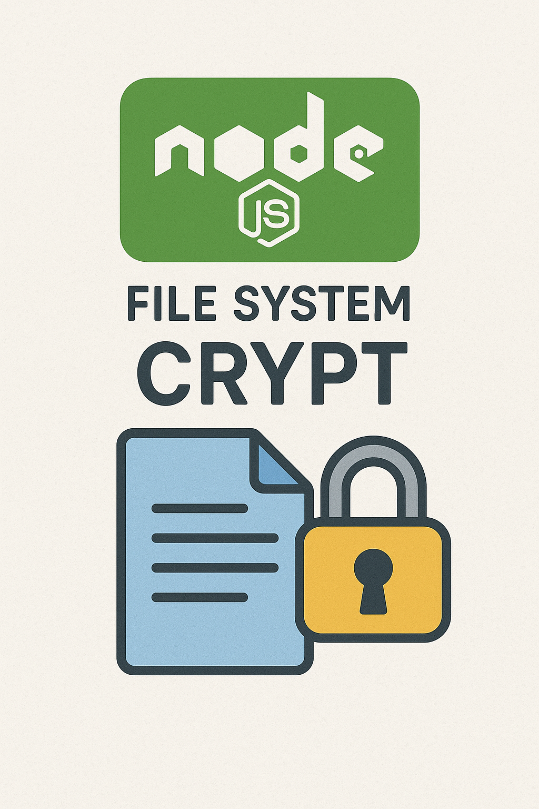
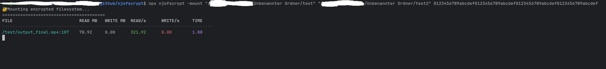
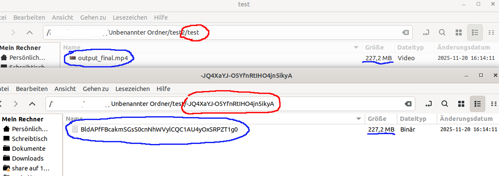

# NjsFsCrypt




NjsFsCrypt mounts one or more folders (with configurable path depth) into another folder. All contents are encrypted using AES-256-GCM, including filenames and folder names, ensuring strong confidentiality. The library can be used directly via the command line, or its classes can be integrated into other applications for custom workflows. Its virtual file system is designed modularly, allowing the creation of additional virtual sub-file systems.

From a security perspective, NjsFsCrypt ensures that both data at rest and metadata (filenames, folder structures) remain encrypted, protecting against unauthorized access or tampering. In terms of utility, it provides a flexible, programmatically accessible encrypted file system that can be embedded into other tools or automated workflows, making it suitable for secure storage, sandboxing, and application-level encryption needs.


# Important
- Very experimental! Make backups before using it.
- Tested only under Linux
- The speed is now good enough to play movies smoothly
- Secure your key & don't use the key that's in the code; that was only for development purposes
  - A 32-byte key (256 bits) is cryptographically extremely secure as long as it is randomly generated!
    - If you lose the key, you will never get your data back.

# Install
#### Step 1
```shell
sudo apt-get install libfuse-dev libck-dev
```

# Use CLI
```shell
Usage:
  njsfscrypt -keygen [length]
  njsfscrypt -mount <storagePath> <mountPath> <hexKey>

Commands:
  -keygen               Generates a new encryption key.
                        Optional: length (default 32)

  -mount                Mounts an encrypted filesystem.
                        Requires:
                          1) storagePath  (folder containing encrypted files)
                          2) mountPath    (FUSE mount folder)
                          3) hexKey       (64 or 128 hex chars, depending on key size)

Examples:
  njsfscrypt -keygen
  njsfscrypt -keygen 64
  
  njsfscrypt -mount ./storage/test ./mnt/test2 012345abcdef...
```

### ✔️ Verify the Mount

To confirm the filesystem is mounted correctly, run:

```shell
mount
```


You should see an entry similar to this:

```shell
/dev/fuse on /mnt/test2 type fuse (rw,nosuid,nodev,relatime,user_id=1000,group_id=1000)
```

This indicates that the FUSE filesystem is active and mounted at /mnt/test2.

### Screenshots


