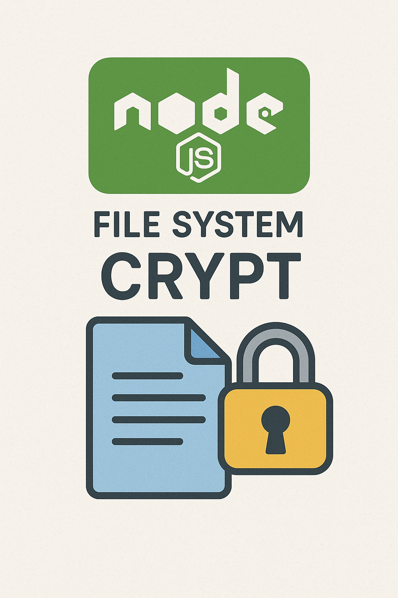
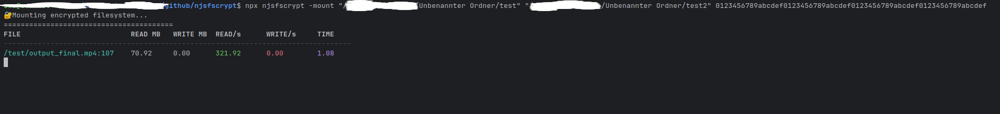
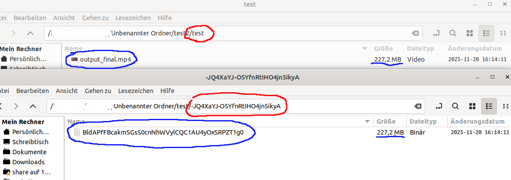

# NjsFsCrypt




NjsFsCrypt mounts one or more folders (with configurable path depth) into another folder. All contents are encrypted using AES-256-GCM, including filenames and folder names, ensuring strong confidentiality. The library can be used directly via the command line, or its classes can be integrated into other applications for custom workflows. Its virtual file system is designed modularly, allowing the creation of additional virtual sub-file systems.

From a security perspective, NjsFsCrypt ensures that both data at rest and metadata (filenames, folder structures) remain encrypted, protecting against unauthorized access or tampering. In terms of utility, it provides a flexible, programmatically accessible encrypted file system that can be embedded into other tools or automated workflows, making it suitable for secure storage, sandboxing, and application-level encryption needs.


# Important
- Very experimental! Make backups before using it.
- Tested only under Linux
- The speed is now good enough to play movies smoothly
- Secure your key & don't use the key that's in the code; that was only for development purposes
  - A 32-byte key (256 bits) is cryptographically extremely secure as long as it is randomly generated!
    - If you lose the key, you will never get your data back.

# Install
#### Step 1
```shell
sudo apt-get install libfuse-dev libck-dev
```

# Use CLI
```shell
Usage:
  njsfscrypt -keygen [length]
  njsfscrypt -mount <storagePath> <mountPath> <hexKey>

Commands:
  -keygen               Generates a new encryption key.
                        Optional: length (default 32)

  -mount                Mounts an encrypted filesystem.
                        Requires:
                          1) storagePath  (folder containing encrypted files)
                          2) mountPath    (FUSE mount folder)
                          3) hexKey       (64 or 128 hex chars, depending on key size)

Examples:
  njsfscrypt -keygen
  njsfscrypt -keygen 64
  
  njsfscrypt -mount ./storage/test ./mnt/test2 012345abcdef...
```

### ✔️ Verify the Mount

To confirm the filesystem is mounted correctly, run:

```shell
mount
```


You should see an entry similar to this:

```shell
/dev/fuse on /mnt/test2 type fuse (rw,nosuid,nodev,relatime,user_id=1000,group_id=1000)
```

This indicates that the FUSE filesystem is active and mounted at /mnt/test2.

### Screenshots




# Programmatic API

The library exposes the same building blocks the CLI uses, so you can compose
your own mounts, register multiple filesystem backends behind a single mount
point, and drive everything from your own code.

## Minimal example

```ts
import {
    CryptFS,
    DirectFS,
    VirtualFS,
    VirtualFSLoggerLevel,
    CryptKey
} from 'njsfscrypt';

const key = CryptKey.hexStrToBuffer(process.env.NJSFSCRYPT_KEY!);

const vfs = new VirtualFS('/mnt/myfs');

vfs.setLogger((level, msg, e) => {
    if (level === VirtualFSLoggerLevel.error) {
        console.error(msg, e ?? '');
    } else {
        console.log(msg);
    }
});

// Plain pass-through for a regular folder
await vfs.register('/', new DirectFS({baseDir: '/data/plain'}));

// AES-256-CTR encrypted sub-mount
await vfs.register('/secure', new CryptFS({
    baseDir: '/data/cipher',
    encryptionKey: key,
    blockSize: 64 * 1024
}));

await vfs.mount();
```

`mount()` and `unmount()` return `Promise<void>` that resolve when the kernel
has confirmed the operation, so they can be awaited or chained.

## Mount options

The third constructor argument tunes the underlying FUSE mount:

```ts
new VirtualFS('/mnt/myfs', /* debug */ false, {
    force: false,        // do not forcibly unmount an existing mount at the path
    allowOther: true,    // allow access by other users (requires user_allow_other)
    name: 'myfs'         // display name shown by the `mount` command / Finder
});
```

The defaults preserve the previous hard-coded behaviour (`force: true`,
`allowOther: false`), so existing call sites do not need to change.

## Custom backends

`VirtualFSEntry` is a thin interface; any implementation can be registered
under a path prefix. Sub-mounts are resolved by longest-prefix match:

```ts
import type {VirtualFSEntry} from 'njsfscrypt';

class MyBackend implements VirtualFSEntry {
    // …implement readdir / getattr / open / read / write / …
}

await vfs.register('/in-memory', new MyBackend());
```

The interface covers the full FUSE op surface used by the runtime:
`readdir`, `getattr`, `setattr`, `open`, `read`, `write`, `release`,
`create`, `unlink`, `mkdir`, `rmdir`, `rename`, `truncate`, `ftruncate`,
`access`, `statfs`, `flush`, `fsync`, `symlink`, `readlink`, `link`, `mknod`.

## Stats

```ts
const stats = vfs.getStats(); // Map<`${path}:${fd}`, VirtualFSStats>
```

Per-handle counters cover read/write byte totals, durations and op counts.
Stats survive `rename` (the key is rewritten) and are populated for both
`open` and `create`.

## Error model

Backends signal POSIX-style failures by throwing either:

- `ErrnoFuseCb(fuseCode, message?)` — when you already know the FUSE error number
- a Node `fs` error with a string `code` (`'ENOENT'`, `'EACCES'`, …) — these
  get mapped to the matching FUSE constant via `ErrorUtils.toFuseError`

Anything else falls back to the caller-supplied default (typically `EIO`
or `ENOENT` depending on the op).

# Testing

```shell
npm test
```

Builds a separate `dist-test/` tree and runs the Node-native `node:test`
suite (no extra runtime dependencies). Coverage includes:

- `CryptKey` — hex/buffer roundtrip and randomness
- `VirtualFSHandler` — fd allocation lifecycle
- `DirectFS` — file ops, symlinks, hard links, mknod, fsync, lstat
- `CryptFS` — AES-CTR roundtrip across block boundaries, encrypted name
  encoding, encrypted symlink targets, hard links, header persistence
- `ErrorUtils.toFuseError` — error translation matrix
- `VirtualFS` routing — sub-mount path stripping, EXDEV cross-mount,
  stats re-key on rename, lifecycle and xattr stubs

# Project structure

```
src/
  cli.ts                  CLI entry point (`-keygen`, `-mount`)
  index.ts                public re-exports
  main.ts                 npm `main` entry; re-exports index
  Error/
    ErrnoFuseCb.ts        carry a FUSE error code through a thrown Error
    ErrnoException.ts     shape of Node fs error objects
  FS/
    VirtualFS.ts          FUSE binding + sub-mount router + stats
    VirtualFSEntry.ts     interface implemented by all backends
    VirtualFSHandler.ts   per-backend fd allocation
    VirtualFSTypes.ts     handle/fd shared types
    DirectFS.ts           pass-through backend
    CryptFS.ts            AES-256-CTR encrypted backend
  Key/
    CryptKey.ts           keygen + hex→sha256 buffer
  Utils/
    ErrorUtils.ts         centralised FUSE error translation
test/                     node:test suites (mirrors src/ layout)
```